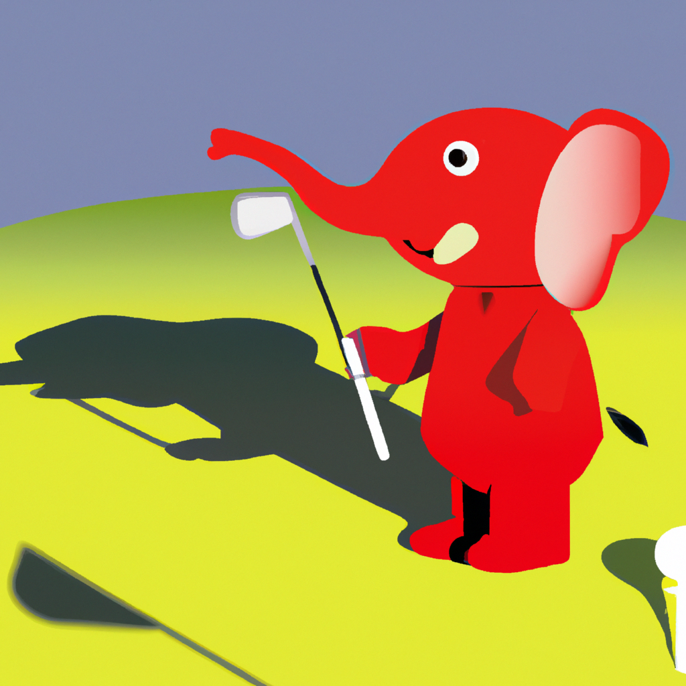

# flutter_art_generator

Flutter implimentation of openAI api to demonstrate art genreration.

## Getting Started

- [Download APK](https://raw.githubusercontent.com/Kunal0127/flutter_art_generator/refs/heads/master/apk/app-release.apk?token=GHSAT0AAAAAACW7TUDESSQUHVMFNDDVLT42ZYCMEFQ)

## all models from OpenAI

    

## chat

## image generation

    

## art generation

    

 

## dall-e-2 vs dall-e-3

<table>
  <tr>
    <th>dall-e-2</th>
    <th>dall-e-3</th>
  </tr>
  <tr>
    <td></td>
    <td></td>
  </tr>
</table>

## variation

                
   
    
